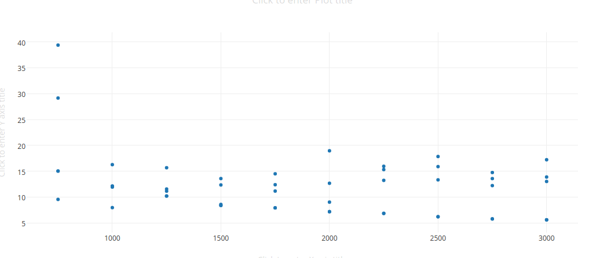

the source data has this structure, represented as a file tree. 
all leaves are named data.json. 

'congress'
	<int> // range: 1:114 . represents sessions of congress
		'votes'
			<int>|<char> 
				('h'|'s')<int>
					'data.json'
					
the govtrack getter traverses 'congress' to find all data.json files nested as in the above tree.
together, these data.json files contain all votes, all bill texts, and mentions of all voters. 

for more information about the voters, we mine congress-legislators.csv. 
this file contains more information, including personalia like gender and age, as well as party membership and wikipedia links

# Govtrack data getter

## to use

 1. make sure db_putter is running
 2. sh sw/converters/secondary/import-bulk-govtrack.sh
 3. wait
 4. python sw/converters/govtrack
 5. wait
 
## features

### multithreading

the getter dispatches a number of worker threads which navigate through the bulk data structure, 
constructing triples as it does so. 
once in a while the workers send their triples to stardog, and empty their local array of triples

#### number of triples before dumping

We set up a unit test for processing a single session, and time it.  
We systematically call this function with parameters threshold and session id.
We use 5 different sessions and the range [750,3000] with interval 10.
We put it in a scatter plot.
We should avoid too low values. 1500 seems good. 
More data is needed to make confident conclusions though. 
However, don't have the resources (time) to focus too much on this. 

## where to code

### to generate more triples 

modify process_session.py

### to tinker with multithreading mechanism

modify govtrack.py and handle.py. test stuff in test.py. 